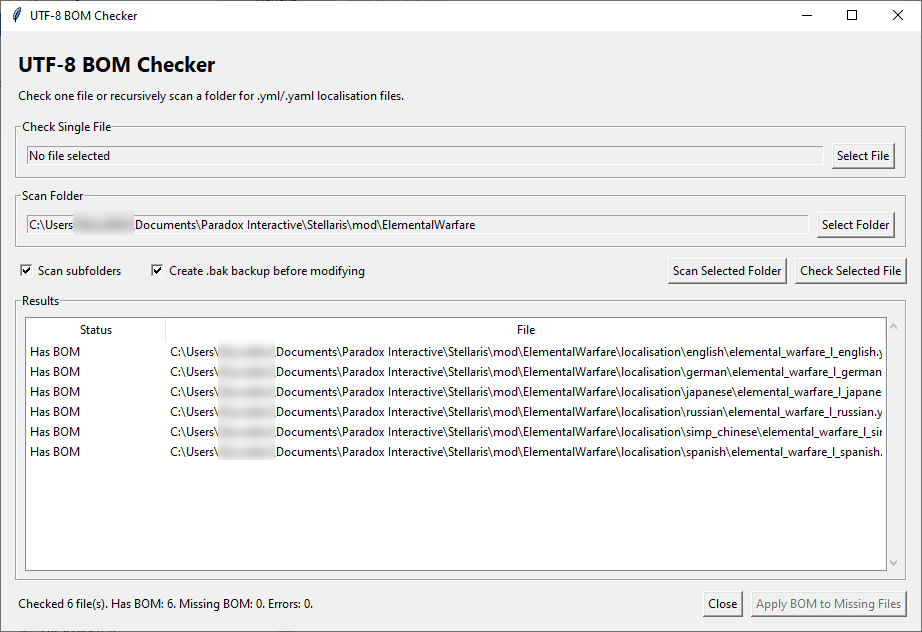

# UTF-8 BOM Checker/Fixer



## Overview

UTF-8 BOM Checker is a simple desktop utility for checking and fixing UTF-8 BOM issues in localization files.

The tool is made for Stellaris which expects localisation files to be saved as **UTF-8 with BOM**.

Windows 10/11 users can download the compiled EXE here:
https://github.com/non-npc/UTF8-BOM-checker/releases/tag/v1.1

---

## Run

```bash
python utf8_bom_checker.py
```

## Features

### Single File Checking
- Select an individual file.
- Detect whether the file already contains a UTF-8 BOM.
- Display the result immediately.

### Folder Scanning
- Select an entire folder.
- Recursively scan subfolders (optional).
- Automatically locate `.yml` localization files.
- Display the status of every file found.

### Bulk BOM Fixing
- Identify files missing a UTF-8 BOM.
- Add the BOM to all missing files with a single click.
- Preserve existing file contents.

### Backup Support
- Optional `.bak` backup creation before modifying files.
- Multiple backups are automatically numbered when necessary.

---

## Typical Workflow

1. Launch the application.
2. Select either:
   - **A single file**, or
   - **A folder containing localization files**.
3. Review the scan results.
4. Click **Apply BOM to Missing Files** if any files are reported as missing a UTF-8 BOM.
5. Verify the updated results.

---

## Supported File Types

The folder scanner currently checks:

- `.yml`